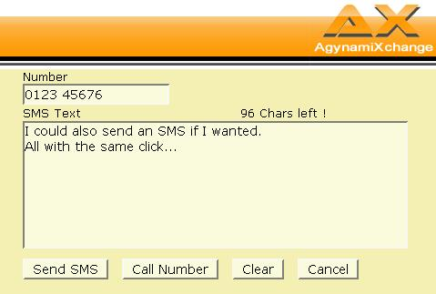

We have created a small perl script that integrates OX with an Asterisk PBX. It uses Asterisk's Manager API which means OX and Asterisk can run on different machines. 

Requirements:
-------------

-   We use the OXSession.pm Perl Module described [here](http://www.open-xchange.org/oxwiki/Talking_20to_20the_20Sessiond_20with_20Perl). Copy it into a directory OXtensions in a path where perl will find it (we put it directly into the cgi-bin next to the click-2-dial script)

<!-- -->

-   We use the following perl modules:

use lib '/usr/lib/cgi-bin'; use CGI; use Net::Telnet (); use Net::LDAP;

Step by Step instructions:
--------------------------

### On the Asterisk side:

You need to include a user into Asterisk's manager.conf (/etc/asterisk in most cases):

[axdial] secret = axdial deny=0.0.0.0/0.0.0.0 permit=127.0.0.1/255.255.255.255 read = system,call,log,verbose,command,agent,user write = system,call,log,verbose,command,agent,user

If your OX Server runs on a different host and with it the click-2-dial script you need to adjust the `permit=` line. Also pick yourself a nice username (in square brackets) and secret.

### On the OX side

The Open-Xchange guys were very smart and included some cool extension points into the groupware. For a detailed explanation please read [this](http://www.open-xchange.org/oxwiki/CommunicationSolutions). So in the file `intranet.conf` you have several hooks you can activate. This has been tested with 0.8.2-RC3 but should work with 0.8.0-5 and above (as stated in the above document). ``

$OX_HOME/etc/groupware/intranet.conf faxURL=http://server/?fax=$fax&name=$contact_name&uid=$user_uid& uid_pass=$user_pass&uid_name=$user_name phoneURL=https://[your-server]/cgi-bin/ax_asterisk.pl?session_id=$sessionid& to_call=$phone smsURL=https://[your-server]/cgi-bin/ax_asterisk.pl?session_id=$sessionid& to_call=$sms

# "true" uses webmail for sending a mail, "link" for external server # "false" makes nothing faxEnabled=link

You must set `faxEnabled=link` in order to activate the links. You must activate all 3 of them or OX will throw a NullPointerException (0.8.2-RC3). Next you need to copy the perl script ax\_asterisk.pl into your cgi-bin directory (usr/lib/cgi-bin und Debian/Ubuntu). Make sure Perl scripts can be executed as cgi scripts. Please open the script in an editor (vi) and check the variable section and the beginning of the script. In most cases you need to adjust them to your needs. The variables are explained in the script. The script will do the following:

-   Whenever there is a telephone number, mobile no or fax number OX will place the code behind ...URL in its place. This makes the phone number clickable. It will open a small popup window (at least on my machine  ) and display error messages there (in case there are any). If successful the window will close automatically. The script is called with the sessionID of the user that clicked and the number that should be dialed.
-   The script will use OXSession to look into the given session and check if it's valid. If not you will see an error message
-   It will then create an LDAP connection to read the user's 'Pager' number. This field must hold the internal extension number that Asterisk should call.
-   If it has collected all data without error it will use the Asterisk Manager to originate a call.
-   After the user phone rings, the user picks up the phone and Asterisk will then dial the given number.

I hope you find this script useful. Resources: [ax\_asterisk.zip](./ax_asterisk.zip)
