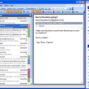

I'm beta testing a new add on product for MS Outlook™. Its called [Taglocity](http://www.taglocity.com/) and allows you to tag your Outlook messages. So no matter what folder a message is in you can assign multiple tags (or call them label or category) to a message.  There is a TagCloud which shows your available tags whereby the size of the font displays the amount of elements associated with the word. You can easily filter for combined tag names, save searches etc. Oh yes, and it supports AutoTagging (it learns) so it tries to take some pain away from you... You can even send your tags embedded in a mail. If the recipient uses Taglocity as well then the original tagging is preserved. I'm using this for just a few days but I find it's a very useful addition. At least I have looked for some way to virtually bundle messages together no matter which folder they're in. For instance, if you receive a message for a project which you need to answer within a given time frame, you can tag the message with the project name as well as something like "Answer this week". You can then QuickFind all messages tagged with "Answer this week" and get hopefully less phone calls of people mad at you because you didn't answer their important mails.
