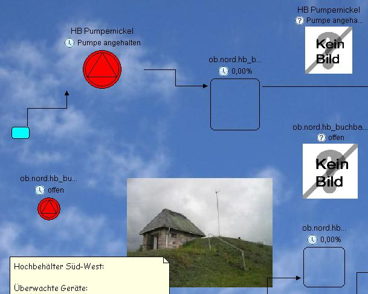
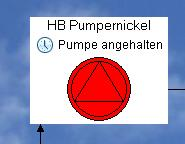
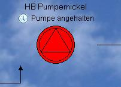

Well then, the other day I tried to improve the appearance of [Net-Herald](http://net-herald.agynamix.de), our monitoring and controlling application ([video here](http://www.agynamix.de/cms/index.php?option=content&task=view&id=13⟨=en)).  In the overview you see the result of this adventure. I have set a background image (the clouds) to make the look more attractive. The user can insert any image (texture, a country map, a technical plan) to merge with the shown elements. The image is drawn in the root element of the GEF diagram (condensed view): protected IFigure createFigure() { Figure f = new FreeformLayer() { @Override protected void paintFigure(Graphics graphics) { Image img = getCastedModel().getImage(); if (img != null) { graphics.drawImage(img, 0, 0); } else { super.paintFigure(graphics); } } }; f.setOpaque(false); f.setBorder(new MarginBorder(3)); f.setLayoutManager(new FreeformLayout()); return f; } The FreeformLayer does not support background images by itself, but this little adaption does the trick. Now, the next problem was the shown elements- they didn't like to be drawn transparently. Even the setOpaque() method could not help: 

Now I took my new learned knowledge about adapting the paintFigure() method and thought about drawing a 1 pixel transparent gif as background of my element. I subclassed Panel() which I use as a container for the element's figures (file attached). Voila!  The 1 pixel image is scaled over the whole background of the element and GEF knows how to (not) display it... Moral: Make the user happy :) [Class TransparentPanel](./TransparentPanel.zip)
