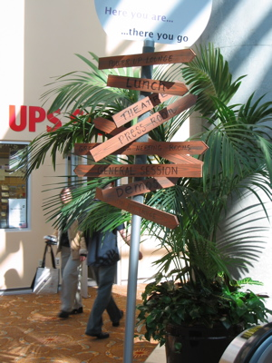

Today was the first day at the EclipseCon. Actually it was Tutorial Day- the conference's sessions start tomorrow.  There where already a lot of people there (the lunch room was filled)- there will probably be a lot more there tomorrow. Since in Net-Herald we use RCP technology I choose my tutorials accordingly. First there was "[Creating Enterprise Business Applications Using Eclipse RCP](http://www.eclipsecon.org/2007/index.php?page=sub/&id=3648)" which was basically a case study about an RCP application with local persistence (when offline) and a J2EE server. Very interesting where some comments about the possibilities one has to relatively easily change Eclipse's look & feel. Scott Delap [wrote an article](http://www-128.ibm.com/developerworks/edu/os-dw-os-eclipse-rcp1.html) about this at DeveloperWorks. Another interesting part was the introduction of the JFace Data Binding framework which actually is a middleware between UI and Model objects. [Scott wrote a 2 part article about this](http://www-128.ibm.com/developerworks/library/os-ecl-jfacedb1/), too. 

Next was an introduction of the [Eclipe Intro Framework](http://www.eclipsecon.org/2007/index.php?page=sub/&id=3655). The topic itself is somehow hard to grasp. Or maybe I had the impression because the session was right after the lunch... The next I remember was me sitting in the [UI Forms tutorial](http://www.eclipsecon.org/2007/index.php?page=sub/&id=3664). Now this one was really interesting. The changes made in Eclipse 3.3 where discussed as well as the overall approach of the UI Forms framework. I haven't really looked into UI Forms before so I can't really tell what's new and what's not. But the tutorial did a great deal to pace the way for incorporating it into own apps. Now for instance there is a validation framework which is open to be used by clients. Whenever there is wrong (or no) data in a field, an indicator is displayed next to the field and the header shows a summary error message. When hovering over the error icons or clicking on them the error messages (which of course must be provided by the client) are shown. I'm planning to integrate the UI forms framework and use it as the basis for most non-modal dialogs. Now I planned this before the tutorial, that's why I choose it :) After all, this was a very interesting day- me being the first time at the EclipseCon. Let's see where all this leads to...
