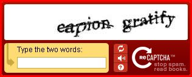

Spam is a bad thing. Spam is ugly, dumb- I don't want it. Probably as much as you do. A while ago I listened to one of the [TWIT](http://www.twit.tv/) networks "[Security Now](http://www.twit.tv/SN)" podcasts entitled "[Are you human?](http://www.twit.tv/sn101)". In this episode Steve Gibson explains the Captcha mechanism (which stands for "*Completely Automated Public Turing test to tell Computers and Humans Apart*"\[Wikipedia\]) and the newly created (at Carnedie Mellon University) reCaptcha mechanism. Both are ways to solve the (actually pretty hard) problem to tell humans and machines apart (Are you a Who?) which is also known as the "Turing Test". Now pattern recognition is getting better and better and computers are gaining rapidly in speed which makes this a harder problem with each passing year. There are now enough algorithms to fool the Captcha mechanisms used at big sites. [reCaptcha](http://recaptcha.net/) to the rescue.  There are several projects going on currently that try to digitize paper books so that they can be archived in digital form, read online, etc. It's so much nicer to have a digital text- you can search it, reformat it. Well, you can't decorate your house- maybe you can use the digital book pages to decorate your ranch in "Second Life™"? Anyway, they use the best OCR (Optical Character Recognition) software available and are still not able to scan all texts for whatever reason. Now that means that those OCR algorithms out there are not able to digitize parts of those books correctly. reCaptcha then takes those words, obfuscates them even more and presents them to the user. Humans, of course, usually recognize the words and can tell the computer the meaning. reCaptcha always presents you two words: one which is known to the system and one that isn't. The unknown word is presented in multiple combinations with different known words to different users. When a certain amount of users have read the word the same way the words is declared to be known. It is then added to the dictionary of known words. Using this algorithm you actually help digitizing those huge amounts of paper books! So the moral? LEAVE MORE COMMENTS! :) I'd be interested in your opinion upon this thing. Especially, would this mechanism discourage you to leave a comment?
