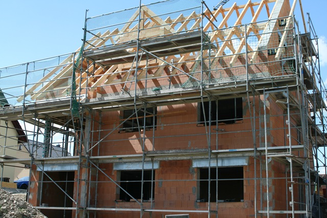
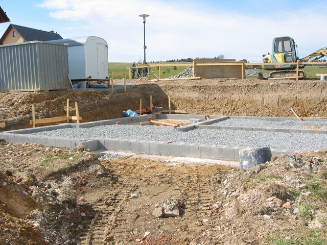
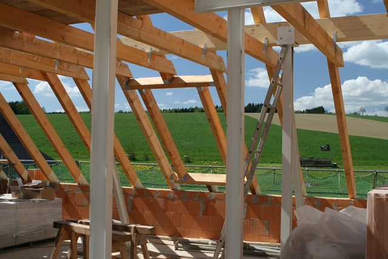

 Last year in October we went shopping for a construction company for our new home. Currently I have rented office space and I'd rather have living and working space together.

Since we life in a [mountainous area](http://maps.google.de/maps?f=q&hl=de&geocode=&q=tannenstr,+09380+thalheim&sll=51.623025,12.27574&sspn=0.010577,0.015621&ie=UTF8&t=h&z=16) houses are usually build here with brick and mortar. Now I don't know how it is in your area but here there are probably more construction companies per village than... than... well, actually I don't know. But there are many. You can choose your flavor from a vast variety. Do you want to build with sand stone, bricks, gas concrete- whatever you like there's always a dozen companies that tell you that there solution is best.

Sounds familiar? The situation reminded me of the IT landscape. There are so many software shops and experts that try to sell you at their golden hammer.

The thing is it probably doesn't matter if you use Java to build a system or Ruby or Python or PHP. Or you use Perl, that way you won't need an obfuscator...

What is most important though is that the people who build your system or house know what they're doing. It saves you a lot of trouble if you hire real experts. Not just marketing guys that know how to draw bubbles and present them to you as your nearly finished system ("We just need to generate the code...") but people who know of the technical details, who know how to communicate between teams so that the work flow does not get interrupted and, most of all, who you can trust.

Trust goes a long way. Now how did we come to choose the architect and construction company for our house? And they haven't been the cheapest of all the options we had!

Several reasons: First and probably most important they have an excellent reputation in our area. I spoke to a dozen of home owners and they all recommended [that company](http://www.gerlachbau.de/). That started to build my trust and in the end I believe it was a big weight in their favor.

Second they where (and still are) very friendly and honest about the things they would or would not do. For instance they did not try to sell me every possible energy saving option you can possibly stuff into your house but only what they believed is the best mixture of options. I never had the feeling that they tried to sell me as much as possible but rather they tried to cater my needs.

Third they brought in their own ideas. I had a basic type of building in mind when I started to contact the companies. Some tried to sell me as much as they could, some just took the plans and calculated a price. What [Gerlach Bau](http://www.gerlachbau.de/) did was to bring in their own experience and creativity. They really helped us develop a house that would fit better than our initial plans. They told us the things they would do different and really made us consider options we didn't know existed.

Another very important thing is the proximity to us. The short distance makes it pretty easy for us to just drop by at their office and talk about things that are not yet clear. Or for them to meet with us at the site. As [Ian](http://www.userscape.com/products/helpspot/) has [written in his blog](http://www.userscape.com/blog/index.php/site/comments/talking_to_the_owner/) it is so important to have a fast and easy way to talk to the one in charge (the one who really can make decisions).

 Now that the construction is going along I can say I'm very pleased. They started in mid March (There is a lot of daunting paperwork involved before you are allowed to build a house on your own ground.). Next week we'll have the topping out ceremony (that's basically when the beams of the roof are in place).

There is a fantastic coordination between the different teams at the construction site. All the material they needed was delivered right on time- nobody had to wait. They call in right on time when things need to be discussed in order to maintain a smooth work flow.

Now what can we learn from that?

First they life and thrive in a very crowded market. They are located in an area where many companies try to compete by price (of course if you choose a company that does this you have to life with the result.)

Their greatest bonus is their reputation. of course they need to maintain it with each new customer which in turn builds a better reputation. They respond to our needs and wishes which gives them a great customer service.

 All in all a lot of attitudes that you as a successful software company would want to copy.

Stick to the things you know and build your expertise in your area of interest. Then when customers approach you you have the chance to exceed their expectations by using your honesty and knowledge. Compared with a great customer service you will build a reputation for you and your company that soon will attract new customers.

That is my observation with the recent events that are going on here. What do you think?
