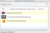

For the next release of Simidude I wanted a deeper integration into the supported platforms, specifically Mac OS X. There are some sites on the web that point out an integration of Swing into OS X but rather few for the SWT toolkit which I use. On such very helpful site is [this on](http://www.cafeaulait.org/slides/eclipseworld2005/macifying/Macifying_SWT.html). It leads to an implementation of CarbonUIEnhancer as described in [the Azureus wiki](http://www.azureuswiki.com/index.php/PreferencesAndAbout) that uses internal API to access the Macintosh application menu and plant "About" and "Preferences" menu entries. However the drawback with this solution is that it is hard coded against carbon internals. That means it either only is compilable with the carbon jar in your class path or you need to have some stub implementation of the carbon api and swap both depending on the platform you'll be running on.  In addition there is the "Quit" menu entry in the OS X application menu that should work accordingly. In the following article I'd like to explain my approach to macifying Simidude. First thing you would need to do is to conditionally exclude the 3 ("Quit", "About", "Preferences") menu entries. I use a method PlatformUtil.isMacOS() to determine if the application run on OS X. The method basically the two system properties "os.name" and "os.arch" to find out the platform it runs on. For Mac it checks against "os.name=='Mac OS X'" and "os.arch=='i386'". So when you build your menu you would have to program something like this for all three menu entries: \[sourcecode language='java'\] if (!PlatformUtils.isMacOs()) { filemenu.add(new Separator()); filemenu.add(exitAction); } \[/sourcecode\] To hook your application into the "Quit" menu entry you have to add an SWT listener like so: \[sourcecode language='java'\] display.addListener(SWT.Close, new Listener() { public void handleEvent(Event event) { shutdownApplication(); // could veto // event.doit = false; } }); \[/sourcecode\] Now to the CarbonUIEnhancer. I started with the code from the Azureus wiki and transformed it the way it only uses reflection to access the carbon api. So it still does the same thing but without compile time dependencies upon carbon. Somewhere in your code you have to instantiate it like so: \[sourcecode language='java'\] if (PlatformUtils.isMacOs()) { try { CarbonUIEnhancer carbonUI = new CarbonUIEnhancer("About "+ApplicationInfo.getApplicationName()); carbonUI.hookApplicationMenu(getShell().getDisplay(), new Listener() { public void handleEvent(Event event) { shutdownApplicationGui(); // could veto // event.doit = false; } }, aboutAction, preferencesAction); } catch (Exception e) { // handle exception } } \[/sourcecode\] I have changed the "hookApplicationMenu" method call. It now takes IAction's as parameters as well as the SWT listener that will listen to the Close event. I have uploaded the source code here: [CarbonUIEnhancer.zip](./carbonuienhancer.zip)
