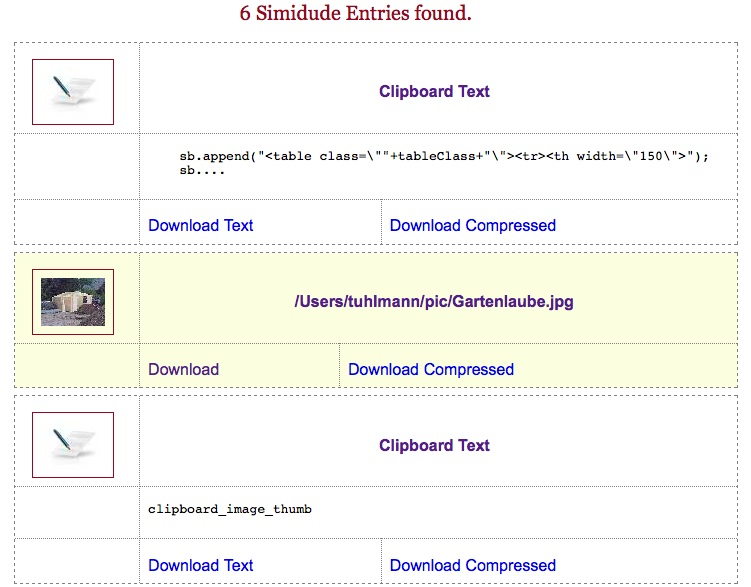

It has been quiet around here for a while, I know. I had been way too busy with that boring stuff that pays my bills. Yet I managed to scratch of time to work on Simidude. I got a lot of feedback from my customers and with the next version 1.3 and the following one I'm trying to incorporate those requests. So here's a first sneak peak of a major new feature in version 1.3:  Version 1.3 will come along with an embedded HTTP server. I have implemented that thing myself and didn't take some out of the box servlet container to make sure the memory footprint doesn't jump into the skies. The HTTP server is very simplistic- in this version it will allow you to browse all entries, select a specific one for preview and then download that entry as is or as a ZIP file. This feature was requested by people who use Simidude to install new machines where they're not allowed to install their own software. Since a browser should be present on any machine with some kind of windowing system they can drag their setup files unto Simidude on one machine and then access that list of files via a browser from the machine they wish to setup. They just need to make sure the browser is installed before trying to use it :) As another new feature I have added compression of entries. You can now save an entry as a compressed ZIP file which might come in handy for instance if you quickly want to convert clipboard text into a compressed file. This is a new option which I will add to the main Simidude gui before releasing 1.3. Please note that when downloading directories via the browser view they will always be compressed and then served as one big file. Some users have requested an option to save the latest clipboard contents before Simidude stops and then reload that contents later. Using this feature Simidude could restore the clipboard contents after a reboot for instance. This is a small and handy feature which I'm also trying to put into 1.3. After the 1.3 release which I want to send out beginning of June if no show stopping bugs are found I will do some gui cleanup and improvements that make the application easier and more fun to use. If you have feature requests for Simidude for an upcoming release please let me know! I'm working hard on this release over the coming weekend. If someone would like to volunteer as a beta tester please give me a note! The communication protocol did not change so you do not need to update all your Simidude installations, just one. The new version will talk to the older ones just fine. This update will be free to all existing customers. Have a great day, Torsten.
