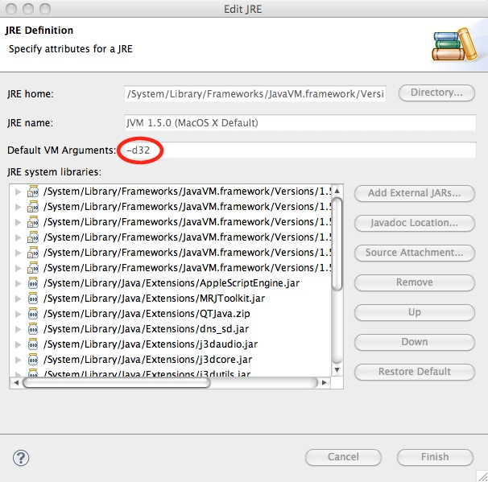

After I received an update for my UMTS modem driver to finally work with Snow Leopard I again decided to update my MacBook Pro to Snowy. After getting that system up to speed again I continued working on Simidude- I'm about to integrate global hotkey support- at least on Windows and Linux for now. Firing up Eclipse, editing a bit and launching Simidude brought me this error:

java.lang.UnsatisfiedLinkError: Cannot load 32-bit SWT libraries on 64-bit JVM at org.eclipse.swt.internal.Library.loadLibrary(Library.java:182) at org.eclipse.swt.internal.Library.loadLibrary(Library.java:159)

Turns out that Snow Leopard tries to start Java applications by default with the 64 bit virtual machine which does not work with Simidude because I bundle it with the 32 bit libraries. Interesting enough when Simidude is launched from the Finder everything works fine... Now, drum roll please, the solution to this problem is pretty simple: Open up the Java JRE definition in Eclipse-&gt;Settings-&gt;Java-&gt;Installed JRE edit your standard Java VM and add the following to the "Default VM Arguments": *-d32*

Happy Snow Leopard-ing...
