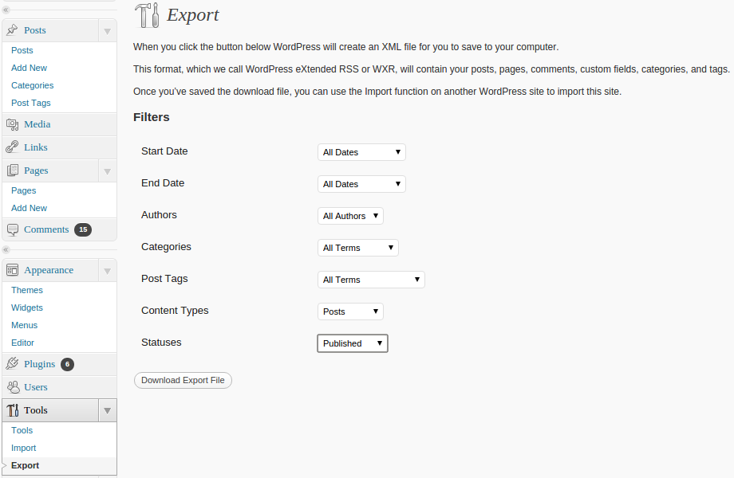

I was moving my old Wordpress site to a new statically generated version. Getting hacked sucks, you know...

This site is generated by [Cryogen](http://cryogenweb.org/), a fairly simple Clojure based site generator. Cryogen uses [Markdown](https://daringfireball.net/projects/markdown/) or [Asciidoc](http://www.methods.co.nz/asciidoc/) files for posts and pages.

Now the task was to extract old posts from Wordpress and convert them into Markdown.

Here are the outlined steps I took to get this done, maybe this list helps future convertees:

* First setting up an Ubuntu VirtualBox to reinstall my Wordpress site. I had teared mine down immediately when I was notified that it was hacked. If yours is still running- well, good for you.
* Now, Wordpress has an export feature that allows you to export posts and/or pages into an `XML` file. I used that to export all posts.

* Then came the fun part. I wipped up a short quick & dirty Clojure script to read the `XML`, extract the posts and important metadata and write them as `HTML` files.
* The script then reads back the `HTML` files, uses `sed` to search and replace old image paths and then uses `pandoc` to transform the `HTML` contents into Markdown.

The script is not polished and hardly performant. But if it helps someone, [here's the gist.](https://gist.github.com/tuhlmann/d9f1e3237eb8f692eb71)

`g ist:tuhlmann/d9f1e3237eb8f692eb71`

The cool part is the way it reads `XML` and uses Clojure's zippers to traverse and transform it.

Have fun,
Torsten.
